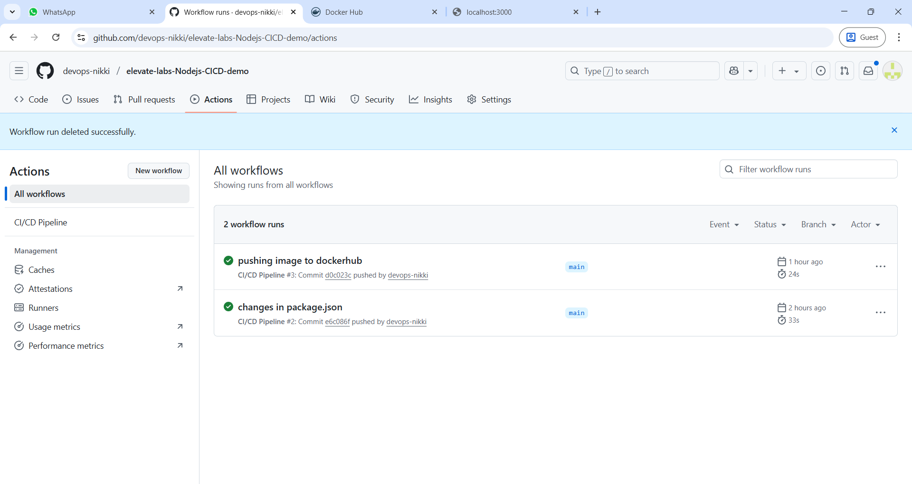
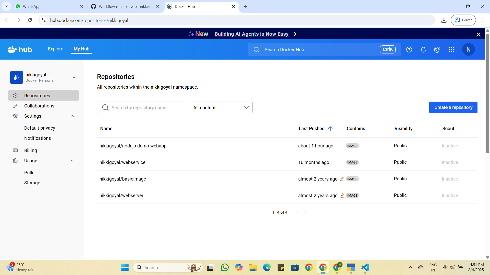
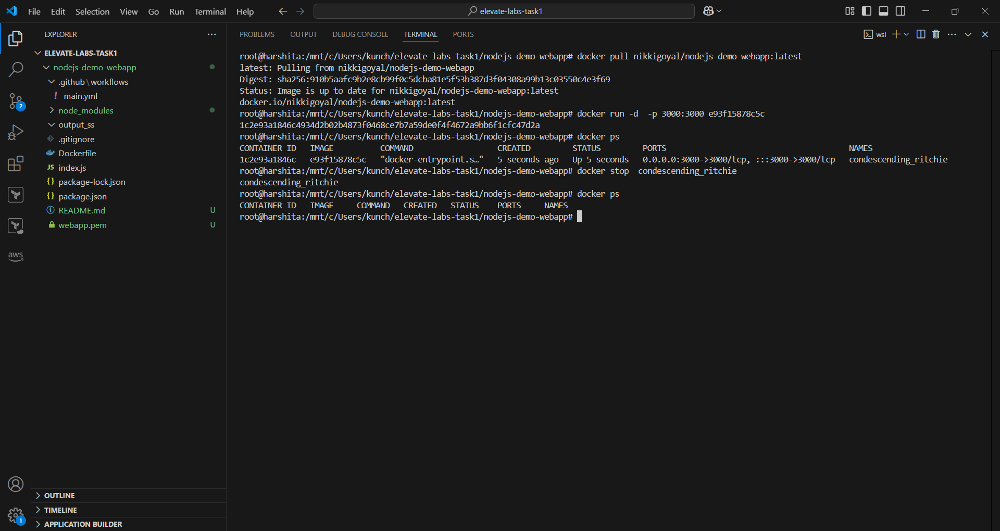
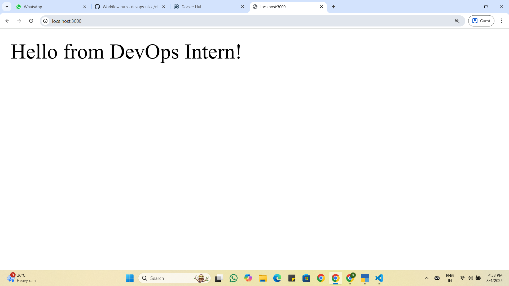

# ✅ Task 1 – Dockerized Node.js WebApp with CI/CD via GitHub Actions

This repository is part of **Task 1** of my DevOps internship. It demonstrates how to containerize a simple Node.js web application using Docker and automate the build and push process to Docker Hub using GitHub Actions CI/CD pipeline.

---

## 🚀 Overview

- Simple Node.js Web Server
- Dockerfile for containerization
- GitHub Actions workflow for CI/CD
- Docker image pushed to Docker Hub
- Tested locally by pulling and running the image

---

## 🔧 Technologies Used

- Node.js
- Docker
- GitHub Actions
- Docker Hub

---

## 📁 Key Files

- `index.js` – Node.js server logic
- `package.json` – Dependencies and metadata
- `Dockerfile` – Container build instructions
- `.github/workflows/main.yml` – GitHub Actions workflow

---

## ⚙️ How to Run Locally

Pull and run the Docker image:

`docker pull nikkigoyal/nodejs-demo-webapp:latest`
`docker run -d -p 3000:3000 <image_id>`

Then Open your browser and visit:

`http://localhost:3000`

---

## 🔐 GitHub Secrets (Used in This Project for CI/CD)

In this project, I have used GitHub Secrets to automate the Docker image build and push process using GitHub Actions.

The following secrets are configured in the repository:

| Secret Name          | Purpose                          |
|----------------------|----------------------------------|
| `DOCKERHUB_USERNAME` | Docker Hub username used for authentication in CI/CD pipeline |
| `DOCKERHUB_TOKEN`    | Docker Hub access token to push images securely via GitHub Actions |

> **Note for Users:**  
You do **not** need these secrets to pull and run the Docker image. These are only used internally by the GitHub Actions workflow to automate Docker deployment to Docker Hub.

---

## 🔄 GitHub Actions CI/CD Workflow

This repository uses GitHub Actions to automate Docker image build and push:

`1. Push to main branch triggers the CI/CD workflow.`

`2. Docker image is built from the repository source code.`

`3. Image is pushed automatically to Docker Hub repository.`

## 📸 Screenshots

### ✅ 1. GitHub Actions Workflow Run (Successful)
Shows the successful execution of the GitHub Actions workflow that builds and pushes the Docker image to Docker Hub.

---

### 🐳 2. Docker Image Successfully Pushed to Docker Hub
Displays the pushed Docker image in Docker Hub under the repository `nikkigoyal/nodejs-demo-webapp`.

---

### 💻 3. Local Docker Pull and Run Test
Demonstrates pulling the image from Docker Hub and running it locally using Docker, followed by verifying the Node.js app on `http://localhost:3000`.

## Task Completion Checklist

✅ Created Node.js web application

✅ Dockerized the app using Dockerfile

✅ Pushed code to GitHub and created CI/CD workflow

✅ GitHub Actions automatically builds and pushes image to Docker Hub

✅ Pulled and tested image locally with docker run

✅ Used GitHub Secrets for secure authentication to Docker Hub

---

## 🙋‍♀️ Contact

`Made by Nikki Goyal`

`GitHub: https://github.com/devops-nikki`

`Docker Hub: https://hub.docker.com/repositories/nikkigoyal`

